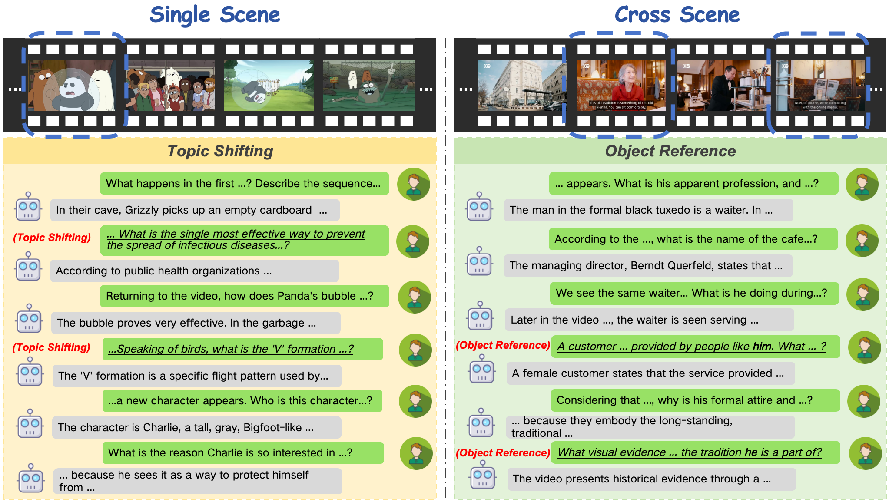
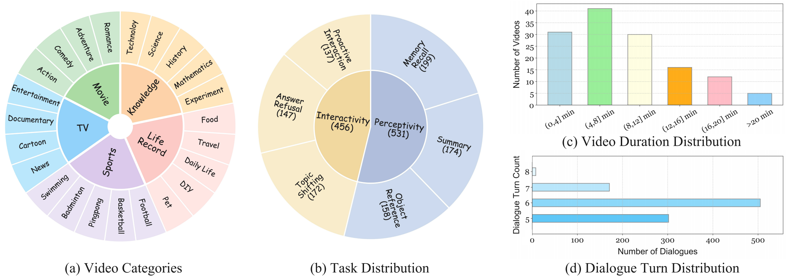
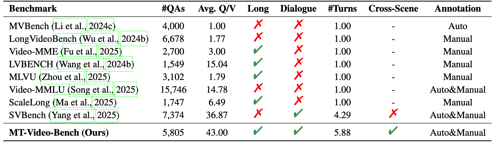
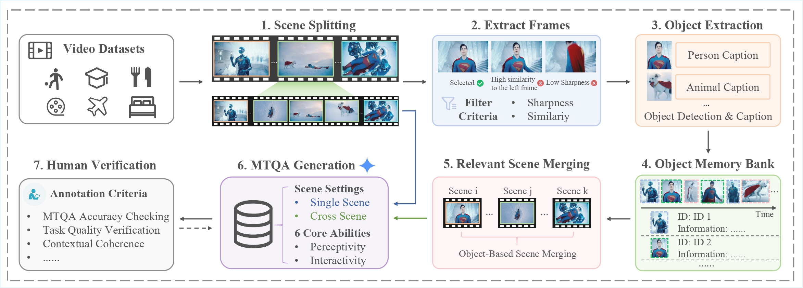
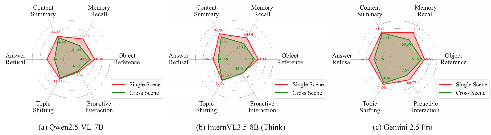
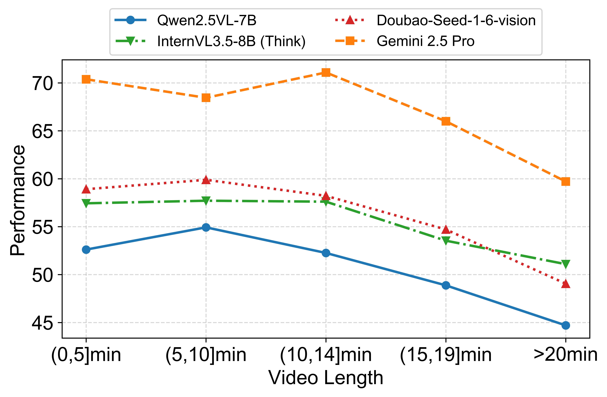
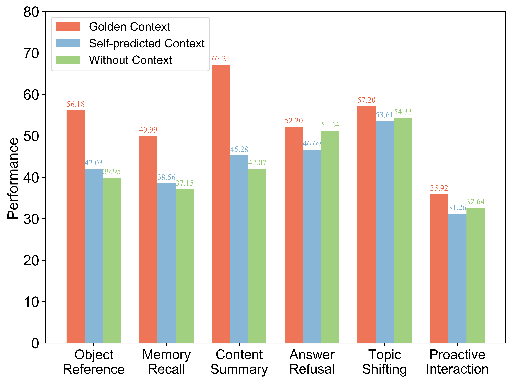
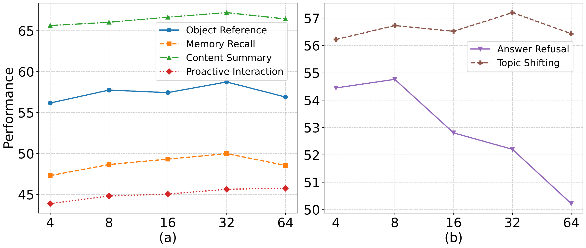
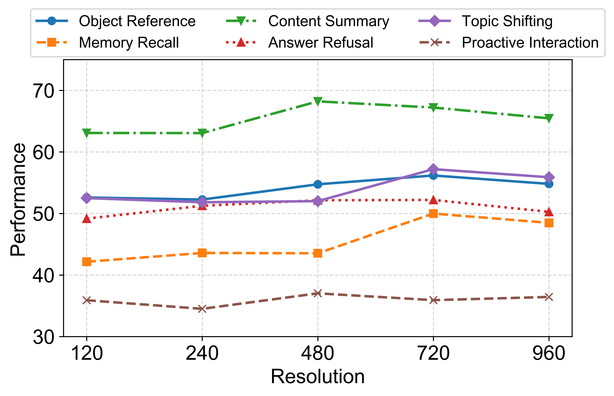

  

<h1 align="center">MT-Video-Bench: A Holistic Video Understanding Benchmark 

for Evaluating Multimodal LLMs in Multi-Turn Dialogues</h1>

  
  <!--  -->
  <a href="https://arxiv.org/abs/2510.10689">
    
  </a >

## ✨ Introduction

Recent advances in **multimodal large language models (MLLMs)** have brought remarkable progress in video understanding.  
However, existing evaluation benchmarks remain limited to single-turn question answering, overlooking the complexity of multi-turn dialogues in real-world scenarios.

🎬 **MT-Video-Bench** fills this gap.  
It emphasizes cross-scene reasoning, long-range dependencies, and interactive adaptability, thereby aligning closely with real-world application demands.

  
   
  <em>Figure 1. Illustration of multi-turn dialogues under single-scene and cross-scene settings. The evaluated questions corresponding to tasks are marked with underlining, and the scenes involved in the entire multi-turn dialogues are marked with blue dotted boxes.</em>

## 🚀 Overview

**MT-Video-Bench**‘s information:

- 📌 **135 videos** from 5 major categories & 23 subcategories 

- 💬 **987 dialogues** (each with 5–8 turns) and **5,805 QA pairs** for evaluating six core abilities
  - Object Reference
  - Memory Recall
  - Content Summary
  - Answer Refusal
  - Topic Shifting
  - Proactive Interaction

- 🧮 **Long-Video Evaluation:** durations up to 20 minutes 
  
- 🧠 Very challenging, even 🥇 best-performing model achieving only ⚠️ 68.45 % overall accuracy, revealing the considerable difficulty of this dataset.

  
   
  <em>Figure 2. It covers a broad range of topics across five main categories: Movie, TV, Sports, Knowledge, and Life Record, each with multiple sub-topics, ensuring a diverse and balanced data distribution.</em>

MT-Video-Bench is a new multi-turn video understanding benchmark that lets you easily compare our dataset with existing video-language benchmarks.

  
   
  <em>Figure 3. Comparison with other benchmarks. Avg. Q/V - the average number of QA pairs per video. \textbf{Long}: whether the average video length is greater than 10 minutes. Cross-Scene - whether the dialogue covers more than 4 scenes.</em>

## 🧩 Pipeline

A glance at how MT-Video-Bench was built👇

1. 🔎 **Video Collection & Single-Scene Splitting:** Manually collect videos → split into short clips using PySceneDetect → generate captions for each clip → merge related clips based on captions to form coherent single-scene videos.
2. 🧾 **Cross-Scene Video Merging:** Extract key frames → perform object detection → build a dynamic object memory bank → retrieve and merge segments sharing common objects or themes.
3. 📦 **Multi-Turn Dialogue Generation:** Use Gemini 2.5 to automatically generate single-scene and cross-scene multi-turn dialogues → select the most suitable task for each scene → design cross-scene questions with an object-centered approach.
4. 🚦 **Human Quality Control:** Remove cases with information leakage → manually verify QA alignment, factual correctness, and difficulty → ensure high-quality, contextually coherent multi-turn dialogues.

  
   
  <em>Figure 4. Data construction and refinement pipeline of MT-Video-Bench.</em>

## 🌟 License

Our dataset is under the CC-BY-NC-SA-4.0 license.

⚠️ If you need to access and use our dataset, you must understand and agree: This dataset is for research purposes only and cannot be used for any commercial or other purposes. The user assumes all effects arising from any other use and dissemination.

We do not own the copyright of any raw video files. Currently, we provide video access to researchers under the condition of acknowledging the above license. For the video data used, we respect and acknowledge any copyrights of the video authors. 

If the original authors of the related works still believe that the videos should be removed, please contact caoruili507@gmail.com or directly raise an issue.

## 📊 Evaluation Results

We evaluate both **closed- and open-source MLLMs** on MT-Video-Bench. Closed-source models include Gemini 2.5 Pro, Gemini 2.5 Flash, and Doubao-Seed-1.6-vision, while open-source models cover **18 representative MLLMs** from Qwen2.5 VL, InternVL3.5, LLaVA, InterVideo, VideoChat, VideoLlama3, and MiniCPM series.

  
   
  <em>Figure 5. Evaluation results on MT-Video-Bench. "OR" - Object Reference. "MR" - Memory Recall. "CS" - Content Summary. "AR" - Answer Refusal. "TS" - Topic Shifting. "PI" - Proactive Interaction. </em>

 
📦 More results can been seen here.

  
   
  <em>Figure 6. Performance comparison of Qwen2.5-VL-7B, InternVL3.5-8B (Think), and Gemini 2.5 Pro across various tasks under single-scene and cross-scene settings.
 </em>

  
   
  <em>Figure 7. Performance comparison of four MLLMs across diverse video lengths.
 </em>

  
   
  <em>Figure 8. Performance comparison of golden context, self-predicted context, and without context for the Qwen2.5-VL-7B model.
 </em>

  
   
  <em>Figure 9. Ablation results of frames on different abilities. (a) Performance of Object Reference, Memory Recall, Content Summary, and Proactive Interaction; (b) Performance of Answer Refusal and Topic Shifting.
 </em>

  
   
  <em>Figure 10. Ablation results of resolutions on different abilities.
 </em>

## 🪶 Citation

If you find **MT-Video-Bench** useful for your research, please cite:

